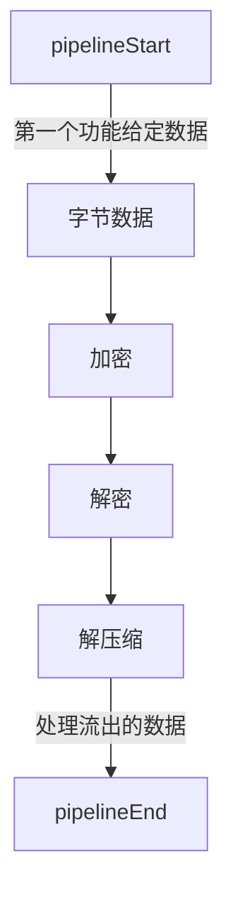
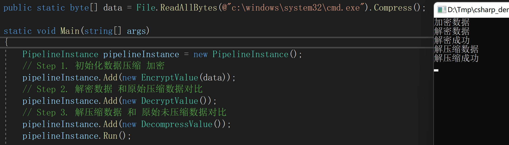

# SimplePipeline

## IPipelineElement

> 接口定义

```c#
    internal interface IPipelineElement
    {
        bool Alive { get; set; }

        bool IsComplete { get; set; }

        bool SetInput(byte[] data);

        bool TryConnect(IPipelineElement next,out bool success);

        void Proceed();
    }
```






